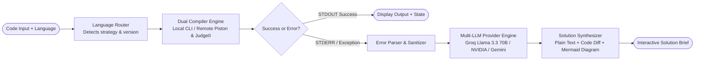
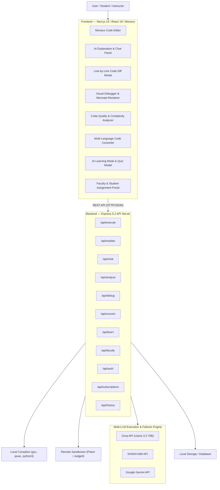

<div align="center">

# Cryptic to Clear (CodeMentor AI)

### Autonomous AI-Powered Compiler, Error Explainer & Visual Debugging Platform

**Cryptic to Clear turns obscure compiler errors and complex stack traces into plain-English explanations, step-by-step code fixes, visual flowcharts, interactive learning modules, and automated faculty assignments.**


</div>

---

## One-line value proposition

**Cryptic to Clear** is an intelligent code execution and debugging platform that instantly converts cryptic compiler errors, memory faults, and syntax exceptions into plain-English insights, line-by-line diff fixes, visual diagrams, code quality analysis, and interactive AI tutoring.

---

## The problem

Understanding compiler errors is one of the biggest friction points for computer science students, junior developers, and engineering teams alike. 

- **Cryptic Error Messages**: C/C++ template errors, Rust lifetime borrow errors, Java null pointers, and Python memory faults (like `Segmentation fault (core dumped)`) often print raw, unhelpful stack traces.
- **Trial-and-Error Fixes**: Developers spend hours guessing syntax, googling obscure error codes, and making random edits without understanding the underlying concept.
- **Lack of Visual Insight**: Traditional IDEs display text-only terminal outputs, providing zero visibility into memory allocations, logic branches, or runtime variable state changes.

Existing tools either only execute code (sandboxes like Replit/Ideone) or offer generic chat windows (ChatGPT) that lack execution context. None of them seamlessly integrate **live code execution, instant error diagnostics, visual step traces, code quality auditing, and curriculum-aligned faculty learning tools** in a single workflow.

---

## Comprehensive Feature Matrix

| Category | Feature | Status | Description |
|----------|---------|--------|-------------|
| **Execution** | **Multi-Language Compiler** | Implemented | Compiles & runs C, C++, Java, Python, JavaScript, Go, and Rust natively or via remote sandboxes. |
| **Diagnostics** | **Plain-English Error Explainer** | Implemented | Translates obscure compiler messages into simple explanations with line numbers. |
| **Refactoring** | **Line-by-Line Code Diff** | Implemented | Side-by-side interactive code diff modal with one-click code replacement. |
| **Analysis** | **Code Quality & Complexity Analyzer** | Implemented | Calculates performance bottlenecks, code smells, readability score, and time/space complexity. |
| **Debugging** | **Visual Debugger & State Trace** | Implemented | Step-by-step memory, variable state tracking, and call stack simulation. |
| **Visualization** | **Mermaid Flowchart Generator** | Implemented | Auto-renders interactive execution logic flowcharts and decision paths using Mermaid.js. |
| **Translation** | **Multi-Language Code Converter** | Implemented | Converts code snippets between C, C++, Java, Python, JS, Go, and Rust while maintaining semantics. |
| **AI Assistant** | **Contextual AI Chat Companion** | Implemented | Interactive AI assistant maintaining conversation history over current code state. |
| **Education** | **AI Code Tutor (Learning Mode)** | Implemented | Generates concepts, guided walkthroughs, and interactive multiple-choice quizzes. |
| **Faculty Portal** | **Course & Assignment Manager** | Implemented | Allows instructors to publish coding assignments and auto-evaluate student submissions. |
| **Export & Sync**| **PDF & Markdown Export** | Implemented | Export structured solution reports as PDF (`jsPDF`) or Markdown files. |
| **Monetization**| **Subscriptions & User Auth** | Implemented | JWT auth, user profiles, subscription plans (Free/Pro), and payment webhook handlers. |

---

## Core Workflows

1. **Write & Execute Code** — Load code in the Monaco web editor with full syntax highlighting & linting.
2. **Compile & Catch Errors** — Execute locally via native compilers (`gcc`, `g++`, `javac`, `python3`) or fall back to remote execution sandboxes (Piston / Judge0).
3. **AI Error Diagnostics & Chat** — Analyze raw `STDERR` to generate structured explanations, line-by-line diffs, and visual logic flowcharts, or ask follow-up questions in the AI Chat panel.
4. **Visual Debug & Quality Audit** — Run step-by-step memory execution traces and calculate code complexity/readability metrics.
5. **Convert & Learn** — Translate code across languages, generate interactive quizzes in Learning Mode, or complete faculty assignments.
6. **Export & Share** — Download structured reports as PDF/Markdown or save sessions to project history.

---

## How the AI & Execution Engine Works



| Component / Agent | Role |
|-------------------|------|
| **Language Router** | Identifies target language, sets execution parameters, and configures compiler flags. |
| **Dual Compiler Engine** | Runs code inside isolated local temporary environments (`gcc`, `g++`, `javac`, `python3`, `node`) with fallback to remote sandboxes (Piston / Judge0). |
| **Error Parser & Sanitizer** | Strips environment file paths, extracts raw compiler line numbers, and formats stack traces for LLM ingestion. |
| **Multi-LLM Provider Engine** | Routes diagnostic prompts to Groq (`llama-3.3-70b-versatile`), with dynamic key rotation and fallback to NVIDIA NIM or Google Gemini APIs. |
| **Solution Synthesizer** | Assembles plain-English root cause analysis, generates line-by-line code diffs, renders Mermaid flowcharts, and creates interactive quizzes. |

---

## Modular Intelligence & Execution Layer

Provider-agnostic architecture separates AI orchestration from physical code execution:

| Capability | Supported Swappable Providers |
|------------|--------------------------------|
| **LLM Inference Engine** | Groq API (`llama-3.3-70b-versatile`), NVIDIA NIM (`meta/llama-3.3-70b-instruct`), Google Gemini API |
| **Local Compilers** | `gcc` / `g++` (C/C++), `javac` / `java` (Java), `python3` (Python), `node` (JavaScript), `go` (Go), `rustc` (Rust) |
| **Remote Sandboxes** | Piston API, Judge0 API (automatic fallback when local tools are unavailable) |
| **Code Editor** | Monaco Editor (`@monaco-editor/react`) with syntax highlighting & auto-formatting |
| **Visualizations** | Mermaid.js (flowcharts & logic graphs), React Syntax Highlighter, Diff Modal |
| **Export Engines** | `jsPDF` (custom PDF generation), Markdown download parser |

---

## Intelligent Routing & Failover

1. **Local CLI Execution First**: Code execution defaults to lightweight local temporary directories (`backend/tmp/exec-*`) with process timeout safeguards and auto-cleanup sweeps.
2. **Remote Sandbox Fallback**: If local compilers are missing or restricted, execution seamlessly fails over to remote Piston/Judge0 execution endpoints.
3. **Multi-LLM Provider Failover**: Primary AI requests use Groq's high-speed Llama 3.3 70B inference engine; rate-limits or API key exhaustion automatically trigger key rotation or fallback to NVIDIA NIM / Gemini.

---

## System Architecture



---

## Backend API Endpoints

| Route | Method | Description |
|-------|--------|-------------|
| `/api/execute` | `POST` | Executes code locally or via remote API sandbox. |
| `/api/explain` | `POST` | Generates plain-English error explanation, root cause, and code diff. |
| `/api/chat` | `POST` | Stateful-aware contextual AI chat companion over source code. |
| `/api/analyze` | `POST` | Audits code quality, performance bottlenecks, and time/space complexity. |
| `/api/debug/trace` | `POST` | Generates step-by-step visual debug state traces. |
| `/api/convert` | `POST` | Converts source code from one programming language to another. |
| `/api/learn` | `POST` | Generates conceptual learning walkthroughs and multiple-choice quizzes. |
| `/api/faculty/*` | `GET`/`POST` | Faculty course management, assignment publishing, and student grading. |
| `/api/auth/*` | `POST` | User registration, login, JWT authentication, and session check. |
| `/api/subscriptions/*` | `GET`/`POST` | Subscription plans, status check, checkout session, and webhooks. |

---

## Local Setup

### Prerequisites
- **Node.js**: v18.0.0 or higher
- **Package Manager**: `npm`
- **Compiler Binaries (Optional for local execution)**: `gcc`, `g++`, `javac`, `python3` (or rely on remote sandbox fallback)
- **API Key**: Groq API Key (or NVIDIA / Gemini key)

### Installation & Launch

```powershell
# 1. Clone Repository
git clone https://github.com/svkatreddy/CodeMentor-AI.git
cd "Cryptic to Clear"

# 2. Backend Setup
cd backend
npm install

# Copy .env.example if .env does not exist yet:
Copy-Item .env.example .env

# Configure your API key inside backend/.env:
# GROQ_API_KEY=gsk_your_groq_api_key_here

# Start Backend Server (runs on http://localhost:5000)
npm start

# 3. Frontend Setup (in a new terminal)
cd ../frontend
npm install
npm run dev
# Open http://localhost:3000 in your browser
```

---

## Environment Variables

### Backend Configuration (`backend/.env`)

| Variable | Description | Default |
|----------|-------------|---------|
| `PORT` | Server listening port | `5000` |
| `GROQ_API_KEY` | **Required.** Primary AI Provider API key | Key from [Groq Console](https://console.groq.com/) |
| `GROQ_MODEL` | Groq LLM model name | `llama-3.3-70b-versatile` |
| `GROQ_BASE_URL` | Groq OpenAI-compatible endpoint | `https://api.groq.com/openai/v1` |
| `NVIDIA_API_KEY` | Optional fallback LLM key | Key from NVIDIA NIM |
| `GEMINI_API_KEY` | Optional fallback LLM key | Key from Google AI Studio |
| `COMPILER_MODE` | Preferred execution strategy | `local` (falls back to `remote`) |
| `JWT_SECRET` | Secret key for auth token signing | Development secret string |

### Frontend Configuration (`frontend/.env.local`)

| Variable | Description | Default |
|----------|-------------|---------|
| `NEXT_PUBLIC_API_URL` | Backend REST API endpoint URL | `http://localhost:5000` |

---

## Running Test Suites

The backend includes comprehensive integration and unit test scripts:

```powershell
cd backend

# Run comprehensive system QA suite
node test_comprehensive_qa.js

# Test multi-language execution (C, C++, Java, Python, JS, Go, Rust)
node test_all_languages_execution.js

# Test AI features & LLM provider key rotation
node test_ai_features.js

# Test authentication flow
node test_auth_flow.js

# Test faculty & assignment management workflows
node test_faculty_auth_flow.js

# Test remote API sandboxes (Piston & Judge0)
node test_remote_apis.js
```

---

## Project Structure

```text
Cryptic to Clear/
├── backend/
│   ├── src/
│   │   ├── controllers/      # Handlers for execute, explain, chat, analyze, debug, learn & convert
│   │   ├── services/         # Local compiler service, remote sandbox & multi-LLM engine
│   │   ├── routes/           # REST endpoints (/api/execute, /api/explain, /api/chat, etc.)
│   │   ├── middleware/       # Auth verification & error handling middleware
│   │   ├── faculty/          # Assignment management & grading logic
│   │   ├── auth/             # User registration, login & JWT auth
│   │   ├── subscriptions/    # Pricing plans & payment webhooks
│   │   ├── history/          # Project history endpoints
│   │   └── server.js         # Main Express API entrypoint
│   ├── test_comprehensive_qa.js
│   └── package.json
├── frontend/
│   ├── src/
│   │   ├── app/              # Next.js 15 app router pages & layouts
│   │   ├── components/       # Monaco Editor, AI Panel, Diff View, Visual Debugger, Mermaid Renderer
│   │   └── lib/              # API helpers, state context & export utilities
│   └── package.json
└── README.md
```

---

## Security & Responsible Execution

- **Sandboxed Execution**: Code execution takes place inside ephemeral, isolated temporary folders with strict execution timeouts (default 5-10s) and memory caps to prevent infinite loops or system resource exhaustion.
- **Sanitized Outputs**: Terminal paths and system details are stripped before transmitting logs to AI models.
- **Environment Safety**: Secret keys are stored strictly in git-ignored `.env` files.

---

## License & Credits

- **License**: MIT License — see [LICENSE](LICENSE).
- **Core Engine**: Powered by Groq AI, Monaco Editor, Next.js, and Express.
